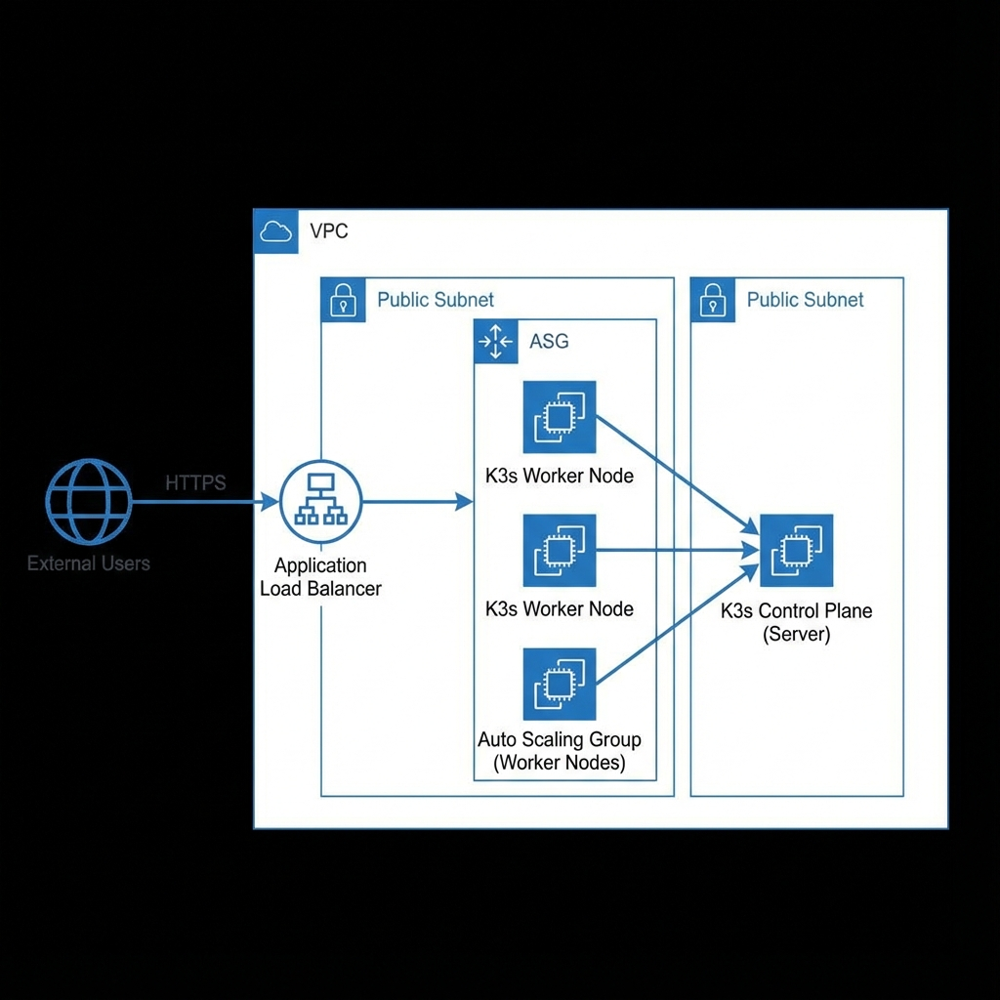

# Kubernetes Auto-Scaling Production Cluster (AWS Free Tier Optimized)

This project provisions a production-grade Kubernetes cluster using **K3s on AWS EC2**, designed to fit within the AWS Free Tier limitations where possible, while implementing full auto-scaling capabilities.

## Architecture

 *[Placeholder - see ASCII below/implementation plan]*

**Key Components:**
- **Infrastructure**: Terraform-managed VPC, Public Subnets (Cost optimized), Security Groups.
- **Compute**: EC2 `t3.micro` instances (1 Control Plane, 1-3 Workers via ASG).
- **Orchestrator**: K3s (Lightweight Kubernetes).
- **Auto-Scaling**:
  - **HPA**: Horizontally scales Pods based on CPU utilization.
  - **Cluster Autoscaler**: Scales EC2 instances when pods are pending.
- **App**: Python Flask (Stateless) with `/metrics` and `/load` endpoints.
- **Observability**: Prometheus & Grafana stack.

## Folder Structure

```
├── app/              # Python Flask Application
├── infra/            # Terraform Infrastructure Code
├── k8s/              # Kubernetes Manifests
│   ├── app/          # App Deployment, Svc, HPA
│   └── infra/        # Metrics Server, Cluster Autoscaler
├── monitoring/       # Helm Values for Prometheus/Grafana
├── scripts/          # Load test scripts
└── Makefile          # Automation commands
```

## Prerequisites

- **AWS Account** (Free tier eligible recommended)
- **Terraform** >= 1.0
- **AWS CLI** configured (`aws configure`)
- **Docker**
- **kubectl**
- **Helm**
- **k6** (for load testing)

## Deployment Guide

### 1. Provision Infrastructure
Initialize and apply Terraform to create VPC, EC2, ALB, and ECR.

```bash
make infra-init
make infra-apply
```

*Note the outputs: `alb_dns_name`, `ecr_repository_url`, `control_plane_ip`.*

### 2. Build and Push Application
Build the Docker image and push it to the created ECR repository.

```bash
make app-build
make app-push
```

### 3. Configure Kubernetes Access
Fetch the `kubeconfig` from the Control Plane (requires SSH access, ensure your IP is allowed in SG or use Session Manager).

```bash
make fetch-kubeconfig
export KUBECONFIG=$(pwd)/k3s.yaml
```

### 4. Deploy Kubernetes Resources
Deploy Metrics Server, Prometheus, Grafana, and the Application.

```bash
make deploy
```

## Validation & Auto-Scaling

### 1. Verification
Check if all pods are running:
```bash
kubectl get pods -A
```

Access the application:
```bash
curl http://<ALB_DNS_NAME>/health
```

### 2. Load Testing (Auto-Scaling Demo)
Run the k6 load test to simulate traffic and trigger HPA.

```bash
make load-test
```

**What to watch:**
1. **HPA**: `kubectl get hpa -w` (Replicas should increase from 1 -> 10).
2. **Cluster Autoscaler**: `kubectl get nodes -w` (If pods stay Pending, new nodes should spawn).

### 3. Observability
Access Grafana (NodePort 32000 on any Node IP) or port-forward:
```bash
kubectl port-forward svc/grafana 3000:80 -n default
```
*Login: admin/admin*

## Cost Analysis (Free Tier)

- **EC2**: 3-4 `t3.micro` instances. Free tier allows 750h/mo. 4 instances = ~7 days continuous run. **DESTROY after use.**
- **ALB**: 750h/mo free.
- **NAT Gateway**: **SKIPPED**. We use Public Subnets to save ~$32/mo.

## Teardown (Important!)

To avoid costs, destroy all resources when finished:

```bash
make infra-destroy
```

---
*Generated by Antigravity*
